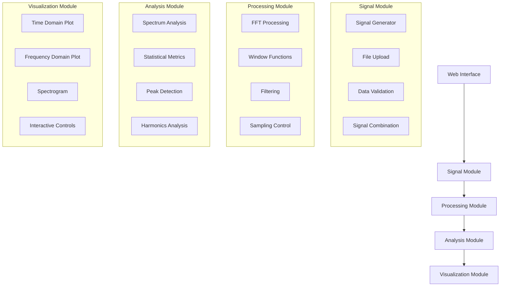

# FFT Application Technical Plan

## 1. Enhanced Application Architecture



## 2. Technical Stack
- Frontend: HTML5, CSS3, JavaScript
- Libraries:
  - Chart.js for basic visualization
  - D3.js for advanced visualizations
  - NumericJS for FFT computations
  - Bootstrap for UI components
  - Math.js for complex mathematical operations

## 3. Expanded Features Breakdown

### Phase 1: Core Functionality & Signal Generation

#### 1. Signal Generator
- Basic Waveforms:
  * Sine wave
  * Square wave
  * Triangle wave
  * Sawtooth wave
- Complex Signals:
  * Multi-frequency composition
  * AM/FM modulation
  * Noise generation (White, Pink, Brown)
  * Pulse trains
- Signal Parameters:
  * Frequency control
  * Amplitude control
  * Phase control
  * Duty cycle (for square waves)
  * Sample rate control
  * Duration control

#### 2. Data Input/Output
- File upload (CSV, TXT, WAV)
- Sample data generation
- Data validation and preprocessing
- Export capabilities (multiple formats)

#### 3. Signal Processing
- FFT implementation
- Window functions:
  * No windowing (default) - raw FFT without window function
  * Rectangular (boxcar)
  * Hamming
  * Hanning
  * Blackman
  * Kaiser
- Window function comparison tool:
  * Side-by-side visualization
  * Spectral leakage comparison
  * Time/frequency domain effects
- Frequency domain calculations
- Signal filtering options

### Phase 2: Advanced Features

#### 1. Signal Analysis Tools
- Power Spectrum Density (PSD)
- Signal-to-Noise Ratio (SNR) calculation
- Total Harmonic Distortion (THD)
- Cross-correlation analysis
- Auto-correlation analysis
- Peak detection and tracking
- Frequency band analysis

#### 2. Enhanced Processing
- Real-time FFT processing
- Overlap-add FFT
- Digital filtering:
  * Low-pass
  * High-pass
  * Band-pass
  * Notch filters
- Decimation and interpolation
- Resampling capabilities

#### 3. Advanced Visualization
- Multiple visualization modes:
  * Linear/Log scale plotting
  * Waterfall plots
  * Spectrogram
  * 3D surface plots
- Interactive features:
  * Zoom/Pan controls
  * Cursor measurements
  * Marker annotations
  * Plot synchronization
- Customizable display options:
  * Color schemes
  * Grid controls
  * Axis scaling
  * Legend positioning

#### 4. User Experience
- Responsive design
- Parameter presets
- Workspace saving/loading
- Tutorial system
- Keyboard shortcuts
- Batch processing capabilities

## 4. Project Structure
```
fft-demo/
├── index.html
├── css/
│   ├── styles.css
│   └── themes/
├── js/
│   ├── main.js
│   ├── signalGenerator/
│   │   ├── basicWaves.js
│   │   ├── complexSignals.js
│   │   └── noiseGenerator.js
│   ├── processing/
│   │   ├── fft.js
│   │   ├── windows.js
│   │   └── filters.js
│   ├── analysis/
│   │   ├── spectrum.js
│   │   ├── statistics.js
│   │   └── peakDetection.js
│   ├── visualization/
│   │   ├── plotManager.js
│   │   ├── timeDisplay.js
│   │   └── freqDisplay.js
│   └── utils/
│       ├── dataLoader.js
│       └── exportManager.js
├── lib/
│   ├── numeric.js
│   ├── d3.js
│   ├── chart.js
│   ├── math.js
│   └── bootstrap/
└── samples/
    └── example_signals.json
```

## 5. Implementation Timeline
1. Setup & Basic Structure (Day 1)
2. Signal Generator Implementation (Day 2)
3. Data Loading & Processing (Day 3)
4. Basic Visualization (Day 4)
5. Advanced Features & Analysis Tools (Day 5-6)
6. Testing & Optimization (Day 7)

## 6. Error Handling & Quality Assurance
- Comprehensive input validation
- Processing error handling
- Performance monitoring
- Unit tests for core functions
- Integration tests for workflows
- Browser compatibility testing